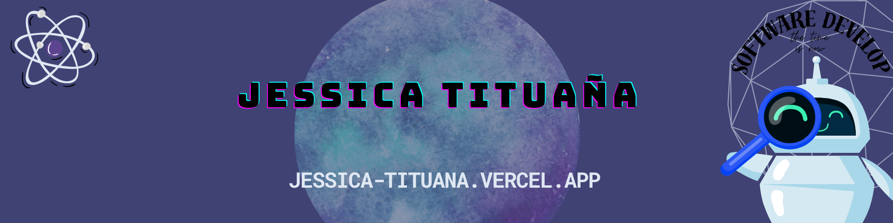
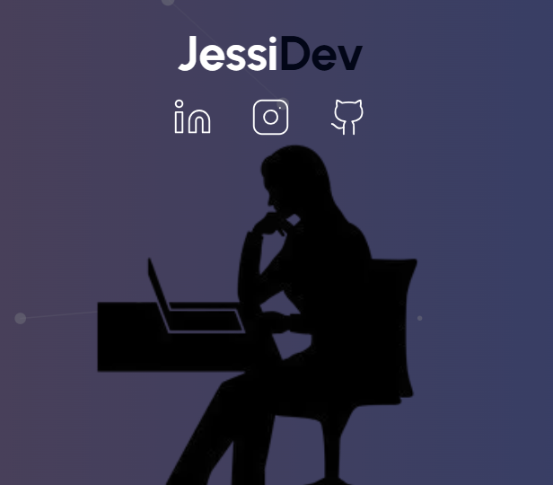

<!DOCTYPE html>
<html lang="en">

<body>

    
    

  <h1 align="center">Hi 👋, I'm Jessica Tituaña</h1>
  <h3 align="center">Full-stack software developer with solid Back-end experience and a passion for Front-end development. I have extensive experience in designing and developing at</h3>

  
  

  <ul>
    <li>🔭 I’m currently working on <a href="https://github.com/jess026p/WhatsApp-Segurity">WhatsApp Segurity</a></li>
    <li>🌱 I’m currently learning <strong>Procesamiento de imágenes en Python</strong></li>
    <li>👯 I’m looking to collaborate on <a href="https://github.com/jess026p/FacturacionElectronica2.0">FacturacionElectronica2.0</a></li>
    <li>📝 I regularly write articles on <a href="https://ciencialatina.org/index.php/cienciala/article/view/11290">ciencialatina.org</a></li>
    <li>💬 Ask me about <strong>react, ionic,node.js</strong></li>
    <li>📫 How to reach me <strong>JesiUwUr@outloook.com</strong></li>
    <li>⚡ Fun fact <strong>I think I'm very funny</strong></li>
  </ul>

  <h3 align="left">Connect with me:</h3>
  

    
    
    
    
  

 <!-- Categoría: ID -->
<h3 align="left">Stack:</h3>

  
  
  
  <!-- Otros enlaces relacionados con IDs -->

<!-- Categoría: Frameworks -->
<h3 align="left">Frameworks:</h3>

  
  
  
  
  
  
  <!-- Otros enlaces relacionados con frameworks -->

<!-- Categoría: Base de Datos -->
<h3 align="left">Data base:</h3>

  
  
  <!-- Otros enlaces relacionados con bases de datos -->

<table>
<tr>
<td width="50%">
  <h3 align="center">Facturacion Electronica</h3>
  

     
    

      
    

    
Es un software que facilita la generación de comprobantes digitales a través de internet de acuerdo con los requisitos establecidos en las leyes del SRI vigentes. Al emitir una factura digital, este software la envía al destinatario por correo electrónico

  
                
</td>

<td width="50%">
   
  <h3 align="center">Simulador de credito e inversiones </h3>
  

    
     
    

      
    

    
Este sistema calcula las cuotas y la rentabilidad del crédito o inversión según el método alemán o francés. También cuenta con administración de perfiles de usuarios para empresas, además de configurar el tipo de crédito y agregar cargos indirectos al crédito
    

  
   
</td> 
</table>   
<table>
<tr>
<td width="50%">
  <h3 align="center">Portafolio</h3>
  

    
    

      
    

    
Diseño web adaptativo, para dispositivos web y móviles, contiene la carta de presentación para incorporarme en el mundo laboral. Comprende módulos como: About me, proyectos, experiencia, habilidades y un formulario de contacto.

  
                
</td>

</table>   

</body>
</html>
